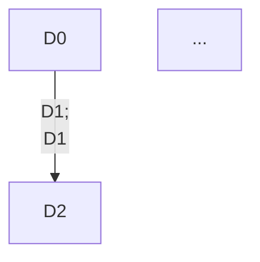

This document serves as a jumping off point for the embedded data acquisition systems within the bat bot. The Adafruit GrandCentral M4, and M4 express contain the SAMD51 microcontroller. 

It is recommended that you use Visual Studio Code with the PlatformIO extension to interface with the board. I do not recommend using the Arduino IDE for working with the main code base because Arduino requires the .ino file extension and typically forces you into writing all code into one file. That being said, I would use the Arduino IDE as a standalone test environment. When contributing new code, I would HIGHLY recommend building your system as a standalone unit before integrating into the rest of the code. As of now we do not have access to a debugger, so if something is causing the MCU to throw an un handleable exception, we cant really gain much insight as to why it happened.

As I will get into later, the SAMD51 gives the capability of multiple clock domains and dedicated peripheral busses,  which are useful because we can run our peripherals like ADCs, DACs, PWM controllers, etc., asynchronously from the CPU, alleviating it from the clock cycles it would take to move data from one peripheral to another or to and from memory. Because of this, we have to synchronize clock domains in order to modify some peripheral registers in our code. This is fairly analogous to how multi threading is handled with mutex locks. Basically, if we try to access data that is being written by another process in a different clock domain, how can we determine whether the data we are reading is the right data? In some cases, not synchronizing clocks before or after a R/W operation, will cause the CPU will throw an unrecoverable exception and halt. 

=======================================================================================================

Other things which may cause unrecoverable exceptions:

- Libraries: 
I am not opposed to using libraries where they are applicable, however, this code configures many parts of the MCU manually, which a library may overwrite causing a many number of problems. If you do use a library, try to find the most lightweight implementation and use that (we want as little dependencies as possible to keep the code 
concise).

- Bad dynamic memory management:
Please do not allocate memory in runtime unless it is absolutely nessesary. If you do however, please ensure that you are freeing this memory when finished with it. 

- Handling interrupts:
Due to the inherent nature of interrupts, if we modify some data within an interrupt handler, we have to be careful about accessing that data in our application loop. Attempting to access data data of this nature can and will lead to unrecoverable exceptions. To avoid this:

```
data_ready = false

some_handler:
	blah, blah blah
	...
	data_ready = true

loop:
	if data_ready
	then 
	     blah.... 
	     data_ready = false
```
It should be clear that this code will only R/W data also used by a handler when the associated interrupt is not being handled. 

- Serial:
This is a simple one to avoid. Arduino's serial object wants to set some of its own clock settings during setup, so when using serial for debugging, call Serial.begin as the last call in the setup code. 

- Reading and writing registers
When working with registers (even when using libraries it is very common that you will have to directly read and write to registers), make sure to use the predefined bit masks i.e. please refrain from setting registers like this:
```
some_reg = (1 << 10) | (1 << 5) | (1 << 8) | ...

some_reg = 0x45
```
Although the top one is slightly better than doing that math by hand and just setting the register equal to the resulting value, both are extremely ambiguous and will require you and others to spend time determining what these bits are actually setting. Instead, the MCU manufacturer provides hardware definitions already. Although these will already exist on your computer, download a copy **HERE** and keep them handy. 

=======================================================================================================

You will also need the datasheet for the SAMD51 board. Fair warning, this datasheet is roughly 1000 pages long and can be very daunting at first. It explains every single nook and cranny of this MCU in immense detail and should hopefully serve as the number one resource when developing code. That being said, the datasheet explains a few things very poorly (rather the implementation of some things is not very intuitive). However, this is for the most part not true and the organization of the MCU may just take some getting used to. 

Each section of the datasheet will start with the general information about the system. This will include, for example, which registers need to be synced when being accessed or written, which other systems have direct interfacing, registers which have special access permissions (like readonly, writeonly or none), among other things. It will then explain the functional description of the system (truly a good review of digital systems) and will end with a table of all contained registers and a summary for each register. 

Names for control lines, multiplexers, constants and registers will follow a similar format to what is seen in the hardware definitions discussed earlier, however the hardware definitions are prefixed with the peripheral name and associated register to avoid naming conflicts. 

Do not use hardware definitions ending in "_val". This is the raw value to be set and hasn't been shifted to set the right bits. There should be a macro that has already shifted the value for you. 

I initially had a hard time translating what the datasheet says to actual code, but after working with it more, patterns emerged and the datasheet became a much more powerful tool. 

=======================================================================================================

The main driver code exists in ML_M4_PlasmaDriver_NI.cpp and hpp. There is also a utils.cpp, hpp. The utils serves as a place to put hardware configuration code that is typically redundant across all peripherals. For example, almost all peripherals can be enabled, disabled and software reset. In other words, if it is code that is not important in the explanation of the system, it should go into the utils. 

Although this is said in about every coding class ever, please do not over or under compartmentalize code, i.e. no ridiculously long ambiguous functions, but also don't make everything a function call because not only is that harder to understand, but it wastes CPU cycles and is thus inefficient. 

Please also read into C macros. Not everything has to be declared as a variable. This is also inefficient. Instead, macro definitions are resolved by the precompiler and replaces all macro definitions in the code with their raw defined value before the code is sent to the compiler. 

=======================================================================================================

Functional Description


Lets start with explaining each of the above modules:

- ADC(Analog to digital converter): This handles mappig the voltages from the microphones into a range of digital values. In our case, we can map from 0 to ```MAX(unit16_t)```. 

- PWMC(PWM controller): This handles outputting a pulse width modulated bat chirp. 

- SRAM(Static RAM): This is the MCU's main memory, and is where our program data exists. We will have to read and write from this memory during data aquisition. 

- DMAC(Direct memory access controller): Typically, if we need to read or write data to and from peripherals, the CPU would serve as the itermediary in transmission. Since memory R/W instructions cost a few clock cycles each, then using the CPU to pass data between peripherals and memory is inefficient. The DMAC allows peripherals to directly access SRAM without CPU intervention. Thus, the DMA talks to the ADC, which is receiving data (hopefully the chirp we emitted) from the microphones, and the PWMC (called TCC w/in SAMD51 hardware defs and datasheet), which requires data from SRAM (the encoded chirp).

Other modules which play a part in this system:

- GCLK(generick clock controller): Handles configuration of the base MCU clock and handles sending clock signals to the various peripherals

- MCLK(master clock): Configured by GCLK, this is the clock that the MCU's processor uses

- NVIC(nested vector interrupt controller): Allows us to register, trigger and handle interrupts

- PORT: Handles configuring I/O (this is one of the things w/in the SAMD51 that is a bit annoying to work with)

Now, I would like to speak on the relationships the DMAC shares with the ADC and PWMC, since by explaining this, hopefully the entire functional system will begin to make sense.

So first, we need to generate the data we are going to output as the bat chirp. This is done in ```uint32_t generate_chirp(void)```. Notice that this function fills up a buffer called ```chirp_out_buffer```, which is ```num_samples``` long (notice that this is the same length as the ADC buffers). Thus, this buffer holds the chirp data that we will use later to modulate a square wave. Also, notice that this function returns the address of the top of this buffer: ```&chirp_out_buffer + num_samples * sizeof(uint16_t)```. After we have called this function, SRAM will hold this chirp data at ```&chirp_out_buffer```. 

Lets look at how we can actually modulate a square wave. Before we initialize a PWMC module (TCC0, TCC1, ..., TCCx), we ask the GCLK controller to pass one of our clocks to the PWMC module. Passing a clock to a peripheral is handled by ```GCLK_PCH_set``` function. Now, during initialization of TCCx, we are given the option to prescale this clock. For the TCCs that we use, this prescaler is set to one.

As a side note, prescaling is a common feature accross many of the peripherals within the SAMD51, including the ADC which we will get to later.

The next important part of initialization is to set TCCx's period register. TCCx actually contains a counter, which counts up to a certain value before resetting back to zero. (this is a massive oversimplification as there are many different counting modes within each TCCx) This value will be our ```PER``` register. You can kind of think of the PER register as a secondary prescaler, because in a sense, that's what we're doing. If ```PER = 1```, then it should be clear that we will get a square wave output at a frequency of:

```f_GCLK/(PER*TCC_prescaler) = 120Mhz/(1*1)``` in our case.

If ```PER = 300```, then ```120Mhz/(300*1) = 400 kHz```

Now, we have a fixed duty cycle square wave whose frequency is fixed to some value we have set. 

Now, we want to modulate this wave by changing its duty cycles using the values we stored for the chirp. Each TCCx has a few different capture/compare channels which we will use to accomplish this. If we set a capture/compare value for one of these channels, then with increment of the TCCx counter, this CC value is compared to the current TCCx counter value. If they are equal, then we do something. In our case, we want to send the output high or low which will define our duty cycle. 

For example, if we have our ```PER = 300```, ```CC = 150``` and we are staring with logic one, then when TCCx's counter reaches 150, then our output will be sent to logic zero for the remainer of the counting to 300. When we reach 300, then the wave will reset back to logic one. Thus, it follows that we should get a 50% duty cycle wave. 

Our goal is to update the ```CC``` register every counter period with a value from our chirp buffer. To avoid synchronization issues, we actually change the value withing ```CCBUF``` which is a buffer register that will automatically move its value to ```CC``` in accordance to TCCx's clock domain. 

This is where it gets a bit tricky. Instead of updating ```CCBUF``` directly with the processor, we have the DMAC handle this data transmission. The DMAC accomplishes this with a few different mechanisms. The DMAC contains channels which we can dedicate to handling different jobs. One of these jobs will be giving TCCx's CCBUF the chirp data from memory. Each DMAC channel needs to be given a set of rules which it will abide by before, during and after data transmission. I will not go into everything we can modify within these settings, but I will go over the notable ones.

For the PWMC these settings are:

```
uint32_t chirp_out_cs =   DMAC_CHCTRLA_BURSTLEN_SINGLE |
                          DMAC_CHCTRLA_TRIGACT_BLOCK  |      		
                          DMAC_CHCTRLA_TRIGSRC(ML_DMAC_TCC1_OVF_TRIG);  
```
The first flag tells the DMAC that we want to send one piece of data, in our case a uint16_t per data transfer. The second flag indicates that one transfer occurs when the DMAC recieves a trigger to start operation. The last flag allows us to specify when we want to send data. In our case, we want to send a new HWORD every time TCC1's counter value reaches its maximum and is going to reset back to zero, ie at the start of every timer period. These settings along with the DMAC channel number, and a priority level are used to initialize a DMAC channel:

```DMAC_CH_init(ML_DMAC_CHIRP_OUT_CH, chirp_out_cs, DMAC_CHPRILVL_PRILVL_LVL2);```

Next, we are going to define the concept of a descriptor. A descriptor is a collection of all the nessesary information required for the DMAC to send/recieve the right amount of data in the right locations. It contains a list of settings which tell the DMAC how to handle this information and contains the information itself. This is all contained within ```DmacDescriptor``` data strcuture.

```
  uint32_t chirp_out_srcaddr = generate_chirp();

  uint16_t chirp_out_ds = DMAC_BTCTRL_VALID |
                          DMAC_BTCTRL_EVOSEL_DISABLE |
                          DMAC_BTCTRL_BLOCKACT_NOACT |
                          DMAC_BTCTRL_BEATSIZE_HWORD |
                          DMAC_BTCTRL_SRCINC        |
                          DMAC_BTCTRL_STEPSIZE_X1;

  DMAC_chirp_descriptor_init(
    chirp_out_ds,
    num_samples,
    chirp_out_srcaddr,
    (uint32_t)&TCC1->CCBUF[ML_TCC1_CH3].reg,
    (uint32_t)&base_descriptor[ML_DMAC_CHIRP_OUT_CH],
    &base_descriptor[ML_DMAC_CHIRP_OUT_CH]
  );
  
  void DMAC_chirp_descriptor_init(const uint16_t btsettings, 
                                const uint16_t btcnt, 
                                const uint32_t srcaddr, 
                                const uint32_t dstaddr, 
                                const uint32_t descaddr,
                                DmacDescriptor *cpy);
```

There is alot to unpack here, so I will try to explain it all in the best way possible. First, we generate the chirp data as discussed earlier which returns the address of the top of the output chirp buffer in memory. This is because the DMAC references memory from its apex location. I'm not entirely sure why, but that's how it is.

Now we define our descriptor settings:

- Validity (```DMAC_BTCTRL_VALID```): This flag tells the DMAC that this descriptor is meant to be served and thus should not be ignored. 
- Beat size (```DMAC_BTCTRL_BEATSIZE_```): This sets the size of the data that we are dealing with. In our case this is ```uint16_t``` which corresponds to the hardware macro ```DMAC_BTCTRL_BEATSIZE_HWORD```. 
- Source or destinination incrementation: This flag tells the DMAC whether to increment the source or the destination pointer. For TCCx, we will need to increment the source pointer i.e., the pointer pointing to the location of the chirp data we generated in memory. In other words, after we send one value from our output chirp buffer to TCCx, the next value we want to send is the one immediately following the one we just sent. In the case of the ADC, we need to increment the destination pointer since the destination is a buffer in memory in which the ADC results are stored. Otherwise, we would be overwriting the same place in memory every time there is a new value transferred from the ADC to memory. 
- Block act (```DMAC_BLOCKACT_```): This flag tells the DMAC what to do after we have finished handling the given descriptor. For TCCx, we tell the DMAC to do nothing (```DMAC_BLOCKACT_NOACT```) and for the ADC, we tell the DMAC to suspend operation (```DMAC_BTCTRL_BLOCKACT_SUSPEND```, which consequently triggers an interrupt to tell us when this occurs)

Lastly, we pass our source address, descriptor settings, length of our output buffer, the destination address (in this case, as we dicussed earlier it will be placed into a ```CCBUF``` for one of the given TCCx channels, for us this is channel 3), An address to the next descriptor (think of a linked list), and lastly where this descriptor should be placed in memory such that the DMAC recgonizes it as a descriptor. A base descriptor is then the first descriptor the DMAC sees when it goes to serve one of its channels (ie. goes to serve the PWMC, or ADCs. Each of the ADCs has its own channel). For TCCx, its base descriptor tells the DMAC to handle sending the entire output chirp buffer to TCCx in increments of the counter period. So when its done, we tell the DMAC to point back to the base descriptor which will repeat this process. 

The concept of a base descriptor and linked descriptors becomes very important when dealing with transmitting data from the ADC. In this case, we are limited by the fact that the DMAC can only handle sendingsome amount (I cannot remeber what this value is atm) half words per transfer. Our ADC buffers are two dimensional arrays with size ```NUM_PAGES * NUM_SAMPLES = 8 * 5000 = 40000 * sizeof(uint16_t)```. 

```
// sampling rate is 1MHz = 1E6 samples/sec
time to fill buffer = num samples * 1/(sampling rate) = 40000 samples * 1/(1E6 samples/sec) = 40000 samples * 1/1E6 sec/samples = 40ms

// chirp duration = 5ms
40ms/8 = 5ms, so 8 pages of 5000 uint16_ts
```
Then, we make a descriptor for each 5ms buffer and link them circularly. That is:


